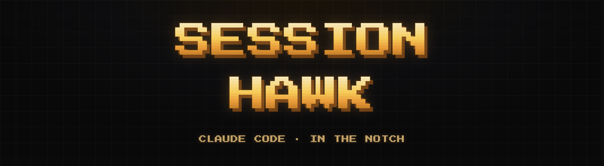

<div align="center">



[](LICENSE)
[](https://jeangalea.com)

**A lean, local-first macOS notch companion for Claude Code.**

</div>

Session Hawk is a notch and menu-bar widget for macOS that shows live Claude Code session status, brokers permission prompts, and gives you a one-click jump back to the terminal where the session is running.

The app installs a hook into `~/.claude/settings.json`. That hook forwards Claude Code lifecycle events to the app over a local Unix socket. Everything stays local: no network calls, no telemetry, and no hosted service.

Supported terminal contexts:

- cmux
- iTerm
- Terminal
- Ghostty
- VS Code and Cursor

## Install

Build from source on macOS 14 or later:

```sh
swift build -c release --product SessionHawkApp
zsh scripts/package-app.sh
```

For development:

```sh
zsh scripts/launch-dev-app.sh
```

## Using it

Once it's running you barely touch it. The whole flow:

1. Open Session Hawk. The first time, it adds one hook to your `~/.claude/settings.json` so it can see your Claude Code sessions. That's the only setup, and it happens automatically.
2. Use Claude Code the way you always do, in any supported terminal. Session Hawk sits in the notch (or the menu bar) and keeps itself up to date.
3. Glance at the notch to see what's going on: which sessions are running, which have finished, and which are waiting on you.
4. When Claude asks permission to run something, approve or deny it right there in the notch. No hunting through terminal tabs to find which session is asking.
5. Click a session to jump straight to the exact terminal or editor tab it's running in.

That's it. No accounts, no dashboards, nothing leaves your machine.

To remove the hook later, run `swift run SessionHawkSetup uninstallClaude` and quit the app.

Session Hawk is a lean Claude-only public fork of the open-source Open Island project.

## License

GPL-3.0. Session Hawk Copyright (C) 2026 Jean Galea.
